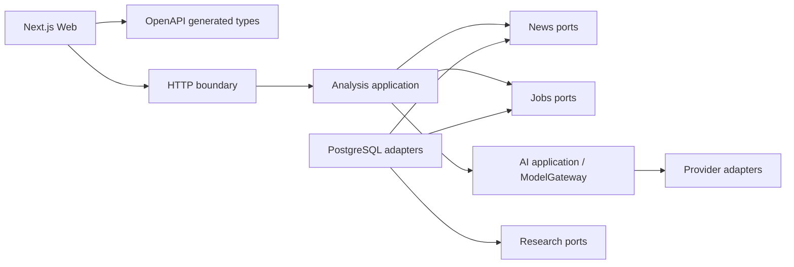

# SignalFrame foundation

Scope: one local, single-user research workspace. The foundation implements text ingestion, best-effort URL ingestion, persisted asynchronous jobs, a deterministic pipeline, structured mock analysis, audit calls, and a responsive workspace. This is a modular monolith, not a complete intelligence product.

## Boundaries

- `news`: source provenance and ingestion. Calls ContentExtractor; never calls a model.
- `analysis`: deterministic steps, validation, domain strategies, synthesis. Depends on ports from news, jobs, ai and research.
- `jobs`: durable PostgreSQL state and events; bounded in-process queue. Single API replica. On restart, unfinished jobs fail explicitly; user can start a new job. This avoids hidden duplicate model spending.
- `ai`: purpose routing and audit application service. Provider implementations live only in infrastructure/ai/providers. Secret values never appear in profiles or audit.
- `research`: hypotheses, evidence, predictions, indicators, topics, and a future SemanticRetriever port. Longitudinal updates remain a later task.
- `infrastructure/persistence`: JDBC repositories and explicit Flyway migrations. No Hibernate schema generation.
- `http`: request validation, errors, correlation ID, asynchronous SSE polling of persistent events.
- `contracts`: authoritative OpenAPI 3.0 with JSON Schema subset, generated Java records and TypeScript API types. Domain result objects share this stable vocabulary. Handwritten services must not duplicate result DTOs.

## Flow

POST news persists a source and news item. POST analyze atomically creates a job and enqueues it. A worker claims QUEUED, records each step/event, synthesizes through ModelGateway, validates the result, then transactionally persists analysis/hypotheses and completes the job. The browser polls job status and consumes SSE; refresh can reconnect to durable events. No request waits for an LLM.

The scaffold steps make deterministic transformations or identify unfinished reasoning. Only synthesis calls the mock/real model in this gate. Facts have exact quotes, offsets, source IDs. Mock output repeats input as reported claims and explicitly states it has not independently verified truth. Inference, hypotheses and predictions stay labeled. Real provider output is subject to the same structural and provenance checks.

Confidence is an ordinal judgment from 0 to 100, not a calibrated probability. Unknown model cost/token counts are null, never fabricated zeros. Mock has zero usage/cost. Full analysis JSONB is the immutable snapshot; hypotheses and confidence events have independent relational identities for future updates. Evidence and prediction relationships have schema and ports, without fake business APIs.

## Failure and operating limits

URL fetch is bounded, redirects disabled, publicly routable destinations only. Extraction failure is a persisted status and actionable message; paste text and submit again. Model output gets one schema-repair attempt, with each attempt audited. Job restart recovery is explicit FAILED, not indefinite ANALYZING. Queue saturation marks a job FAILED. SSE polls the database; it does not occupy worker threads.

No authentication in this local MVP. Bind the API to loopback; do not expose it publicly. Profile PUT is process-local and resets on restart; deployment YAML/env is the durable profile configuration. External queue, authentication and longitudinal research are deferred.

## Verification

Backend integration tests use actual PostgreSQL Testcontainers and Flyway. Browser smoke uses actual API/PostgreSQL with mock provider, at desktop and mobile viewport. Contract generation drift and architecture dependencies are checked. Foundation Gate evidence is recorded in docs/FOUNDATION_GATE.md.

## Dependency direction

Analysis application owns job orchestration; the jobs module has only queue and state ports and does not import analysis. Domain/application code cannot import infrastructure. HTTP consumes application services or read-only repository ports. Persistence implements ports and has no HTTP dependencies.

